# InZone Roadmap

**From Kanban Board to AI-Powered Autonomous Task Execution Platform**

---

> **Vision**: InZone is evolving from a feature-rich kanban board into a platform where AI agents do the work for you. Create a todo, and an AI agent picks it up, executes it using connected tools, and delivers the results -- automatically. Each board becomes an autonomous workspace with its own agent, its own tools, and its own output destinations.

---

## Table of Contents

- [How It Works](#how-it-works)
- [Architecture Overview](#architecture-overview)
- [Board Agent Configuration](#board-agent-configuration)
- [Development Phases](#development-phases)
- [Phase Details](#phase-details)
- [Feature Matrix](#feature-matrix)
- [Use Case Examples](#use-case-examples)
- [Current Status](#current-status)
- [Contributing](#contributing)

---

## How It Works

The core loop is simple: you create a todo, and the board's AI agent handles the rest.

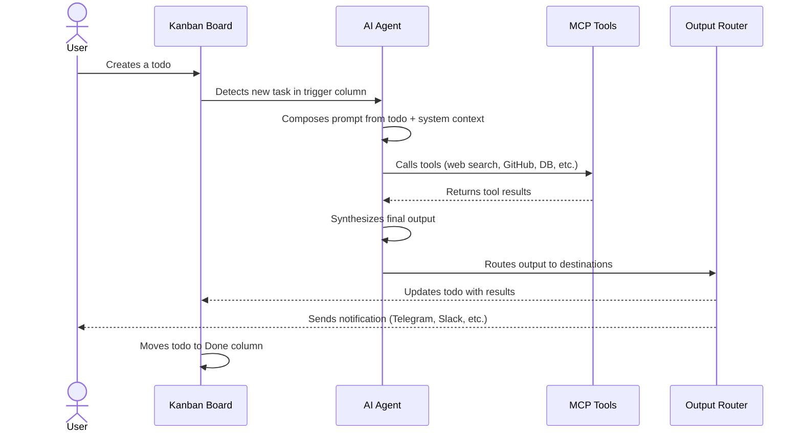

**In practice**: You create a todo that says "Compare the top 5 projectors under $500" on your Research board. The board's agent picks it up, searches the web via Brave Search MCP, compares options, writes a structured report, updates the todo card with the results, sends a summary to your Telegram, and moves the card to Done.

---

## Architecture Overview

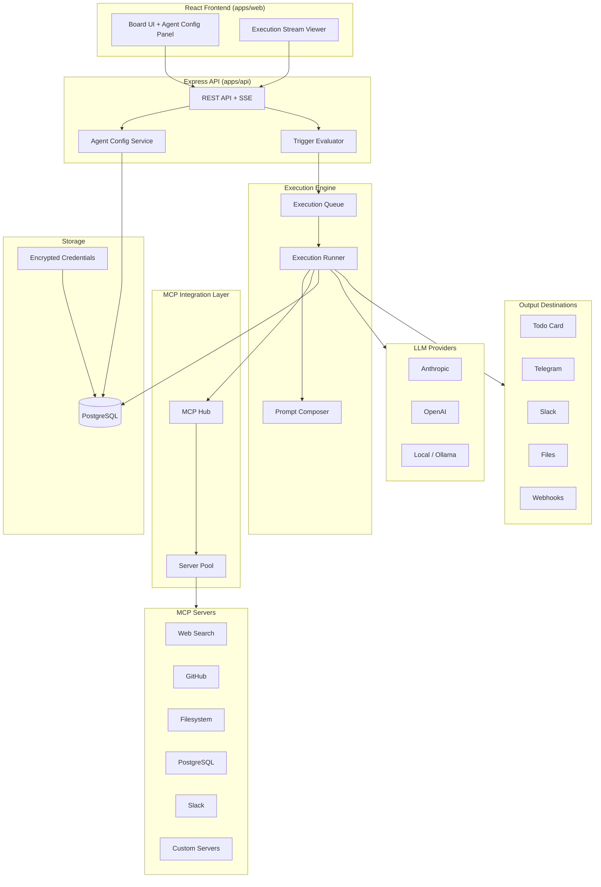

Each board has at most one agent configuration. When a todo is created or moved into a trigger column, the execution engine picks it up, runs the LLM loop with MCP tool access, and delivers results to all configured output destinations.

---

## Board Agent Configuration

Each board can be configured with an AI agent. Here is an example configuration:

```yaml
board: "Personal Projects"
agent:
  name: "Project Assistant"
  model:
    provider: anthropic
    id: claude-sonnet-4-20250514
    temperature: 0.7
    max_tokens: 4096
  system_prompt: |
    You are a personal project assistant. For each task,
    break it down, research what's needed, and produce
    actionable output with clear next steps.
  trigger:
    mode: on_create          # auto-triggers on new todos
    column: "Todo"           # watches this column
  completion:
    move_to: "Done"          # moves card on success
    failure_column: "Backlog" # moves card on failure
  mcps:
    - name: GitHub
      type: stdio
      command: npx -y @anthropic/mcp-server-github
      credentials: [GITHUB_TOKEN]
    - name: Web Search
      type: stdio
      command: npx -y @anthropic/mcp-server-brave-search
      credentials: [BRAVE_API_KEY]
    - name: Filesystem
      type: stdio
      command: npx -y @anthropic/mcp-server-filesystem /tmp/inzone-agent
  outputs:
    - destination: todo_description  # writes results to the card
    - destination: telegram           # sends summary to Telegram
      config:
        chat_id: "123456789"
        bot_token: credential:telegram_bot_token
  limits:
    max_concurrent: 1
    cooldown_ms: 5000
    max_executions_per_hour: 20
    max_tokens_per_day: 500000
```

### Board Templates

InZone ships with pre-configured board templates for common use cases:

| Template | Agent | MCP Servers | Output | Use Case |
|----------|-------|-------------|--------|----------|
| **Research** | Research Agent | Web Search, Calculator | Todo + Telegram | Product comparisons, price research |
| **Dev Project** | Dev Agent | GitHub, Claude Code, Filesystem | Todo + GitHub PR | Feature implementation, bug fixes |
| **Finance** | Finance Agent | Web Search, Calculator, Sheets | Todo + File export | Expense tracking, investment research |
| **Health** | Health Agent | Web Search, Calendar | Todo + Telegram | Workout plans, nutrition tracking |
| **Office** | Office Agent | Slack, Email, Calendar, Jira | Todo + Slack | Meeting prep, status reports |
| **Content** | Content Agent | Web Search, Filesystem | Todo + File export | Blog posts, documentation |

---

## Development Phases

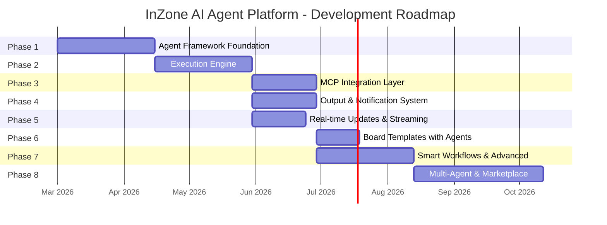

### Phase Dependency Graph

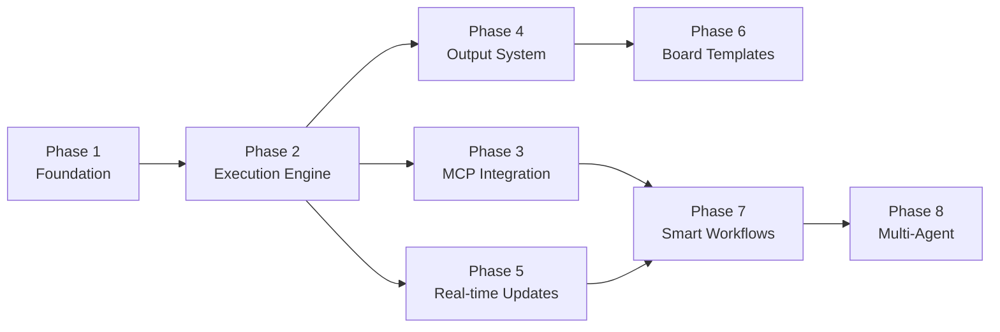

---

## Phase Details

### Phase 1: Agent Framework Foundation

Establish the database schema, API endpoints, and UI for configuring agents per board.

**What is included**:
- Database schema migration (BoardAgent, BoardMcpConfig, AgentOutputConfig, AgentCredential, AgentExecution, AgentExecutionStep)
- Full CRUD API for agent configuration, MCP server configs, output configs, and credentials
- AES-256-GCM credential encryption
- Frontend agent configuration panel in board settings
- MCP server configuration UI with preset library
- Output destination configuration UI

**Key deliverables**:
- Users can configure an agent for any board (model, prompt, trigger, MCPs, outputs)
- Credentials are encrypted at rest
- No execution yet -- configuration only

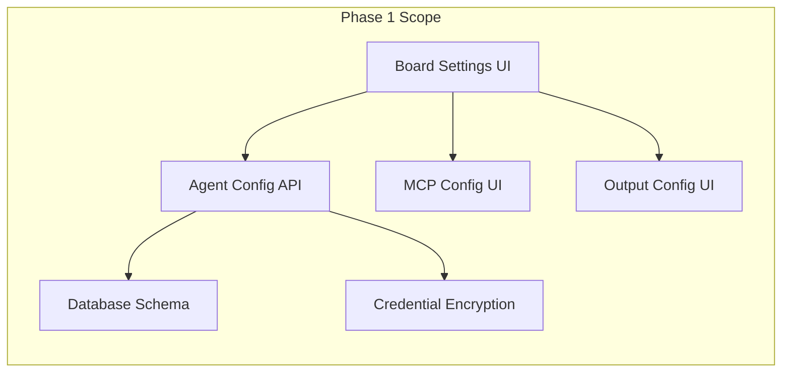

---

### Phase 2: Execution Engine

Build the core agent loop that picks up todos and executes them via LLMs.

**What is included**:
- AgentEngine orchestrator
- PromptComposer (converts todo context into LLM prompts)
- LlmClient abstraction with Anthropic implementation
- ExecutionRunner (LLM loop with tool calling support)
- ExecutionQueue (in-process, database-backed)
- TriggerEvaluator (hooks into todo creation and column moves)
- Execution logging with step-by-step tracking
- Manual trigger endpoint and "Run Agent" button on todos
- Execution history UI in the todo detail panel

**Key deliverables**:
- Agents can execute todos end-to-end
- Full execution history with step details (LLM calls, token usage, duration)
- Manual and automatic trigger modes

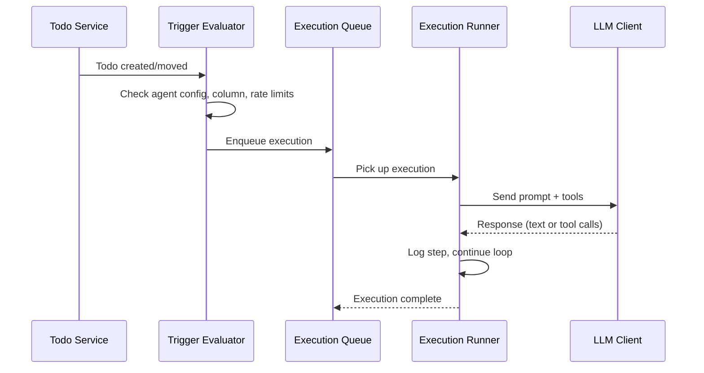

---

### Phase 3: MCP Integration Layer

Connect agents to external services through the Model Context Protocol.

**What is included**:
- McpHub for managing server connections per board
- McpServerPool for connection lifecycle management
- McpToolAdapter for converting MCP tools to LLM tool format
- Tool namespacing (e.g., `brave-search:web_search`, `github:create_issue`)
- Pre-configured MCP server presets (Brave Search, GitHub, Filesystem, PostgreSQL, Slack)
- MCP server connection testing endpoint
- Frontend preset picker and tool call visualization

**Key deliverables**:
- Agents can call any configured MCP tool during execution
- One-click MCP server setup from preset library
- Tool calls are visible in execution step details

---

### Phase 4: Output and Notification System

Deliver execution results to multiple destinations simultaneously.

**What is included**:
- OutputRouter framework with pluggable handlers
- TodoOutputHandler (write results back to the todo card)
- TelegramHandler (Telegram Bot API integration)
- SlackHandler (Slack webhooks and Bot API)
- FileHandler (save output to files with template naming)
- WebhookHandler (generic HTTP POST for custom integrations)
- Handlebars-based output format templates
- Output preview in execution detail view

**Key deliverables**:
- Results are delivered to all enabled destinations after execution
- Customizable output formatting per destination
- Multi-channel notifications (Telegram, Slack, webhooks)

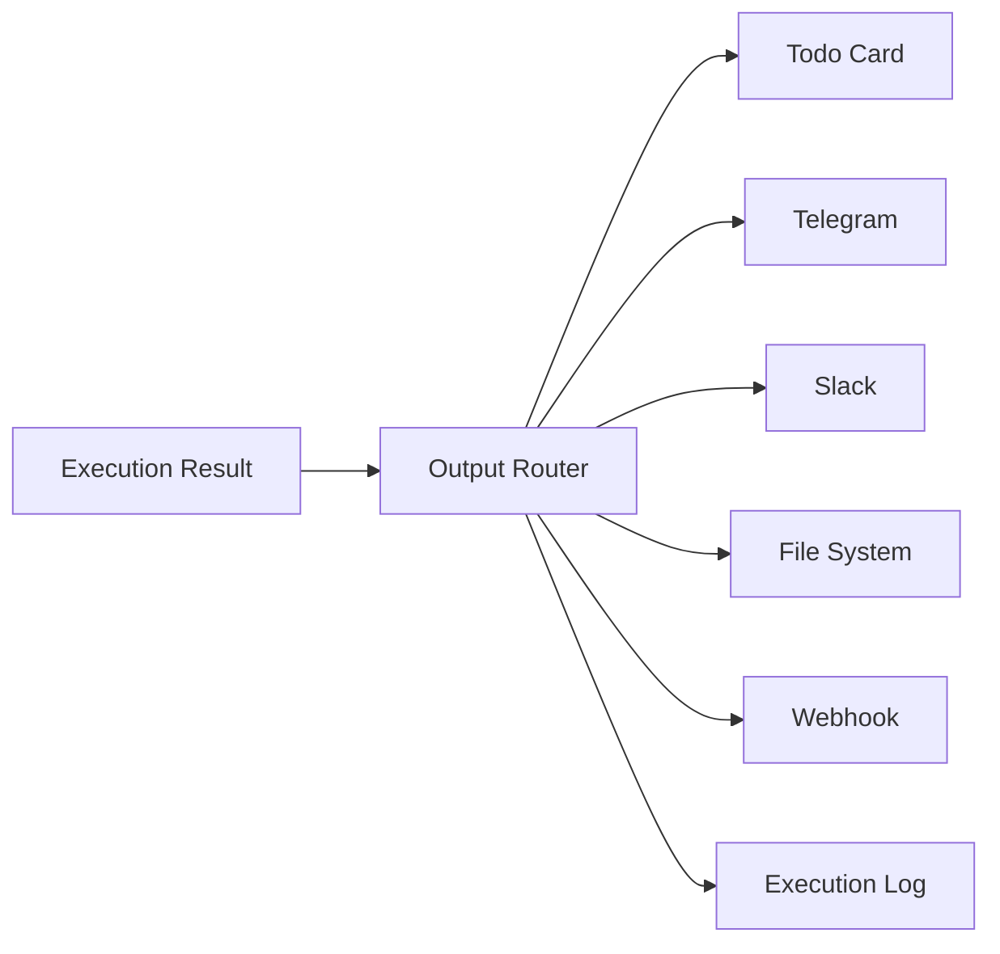

---

### Phase 5: Real-time Updates and Streaming

Show live execution progress as agents work.

**What is included**:
- Server-Sent Events (SSE) endpoint for execution streaming
- `useExecutionStream` React hook
- ExecutionStream component with live step display
- Real-time todo card status updates (Queued, Processing, Completed, Failed)
- Board header agent status indicator (idle, running N tasks, error)

**Key deliverables**:
- Users see agent progress in real time as steps execute
- Todo cards update status live without polling
- Board-level agent activity indicator

---

### Phase 6: Board Templates with Agents

Pre-configured boards that include agent setup for common use cases.

**What is included**:
- Extended BoardTemplate schema to include agent configuration
- Six seed templates: Research, Dev Project, Finance, Health, Office, Content
- Template preview in board creation flow showing agent capabilities
- One-click board creation with fully configured agent, MCPs, and outputs

**Key deliverables**:
- New users can start with a working AI-powered board immediately
- Templates showcase the platform's capabilities

---

### Phase 7: Smart Workflows and Advanced Features

Production-grade capabilities for power users.

**What is included**:
- Cost tracking and per-board token budgets
- Execution analytics dashboard (duration, success rate, cost trends)
- Multi-step workflows (agent chains across boards)
- Scheduled and recurring executions (cron-based triggers)
- BullMQ migration for production-grade job queue
- OpenAI and local model (Ollama) LLM client implementations
- Agent performance metrics

**Key deliverables**:
- Cost visibility and budget controls
- Recurring automated tasks
- Multiple LLM provider support

---

### Phase 8: Multi-Agent Orchestration and Marketplace

Agents that collaborate and a community ecosystem.

**What is included**:
- Agent-to-agent communication across boards
- Workflow orchestration (agent A triggers agent B)
- Community MCP server marketplace
- Shared agent configuration templates
- Agent performance leaderboards
- Plugin system for custom output handlers

**Key deliverables**:
- Agents can delegate sub-tasks to other board agents
- Community-driven MCP server and template ecosystem

---

## Feature Matrix

| Feature | Phase | Status |
|---------|-------|--------|
| Kanban board with drag-and-drop | -- | Done |
| Board templates | -- | Done |
| Rich text descriptions (Tiptap) | -- | Done |
| Labels and tags | -- | Done |
| Detail side panel | -- | Done |
| Mobile responsive design | -- | Done |
| Authentication (Better Auth) | -- | Done |
| Agent config per board | Phase 1 | Planned |
| Credential encryption (AES-256-GCM) | Phase 1 | Planned |
| MCP server configuration UI | Phase 1 | Planned |
| Output destination configuration | Phase 1 | Planned |
| LLM execution engine | Phase 2 | Planned |
| Automatic todo triggers | Phase 2 | Planned |
| Execution history and step logging | Phase 2 | Planned |
| Manual "Run Agent" button | Phase 2 | Planned |
| MCP tool integration | Phase 3 | Planned |
| MCP preset library | Phase 3 | Planned |
| Tool namespacing | Phase 3 | Planned |
| Todo output handler | Phase 4 | Planned |
| Telegram notifications | Phase 4 | Planned |
| Slack notifications | Phase 4 | Planned |
| File and webhook output | Phase 4 | Planned |
| Output format templates | Phase 4 | Planned |
| Real-time execution streaming (SSE) | Phase 5 | Planned |
| Live todo status updates | Phase 5 | Planned |
| Agent board templates | Phase 6 | Planned |
| Cost tracking and budgets | Phase 7 | Planned |
| Execution analytics dashboard | Phase 7 | Planned |
| Scheduled/recurring executions | Phase 7 | Planned |
| Multi-LLM provider support | Phase 7 | Planned |
| Multi-agent orchestration | Phase 8 | Planned |
| MCP server marketplace | Phase 8 | Planned |

---

## Use Case Examples

### Research Task

A user creates a todo: "Compare the top 5 noise-cancelling headphones under $300"

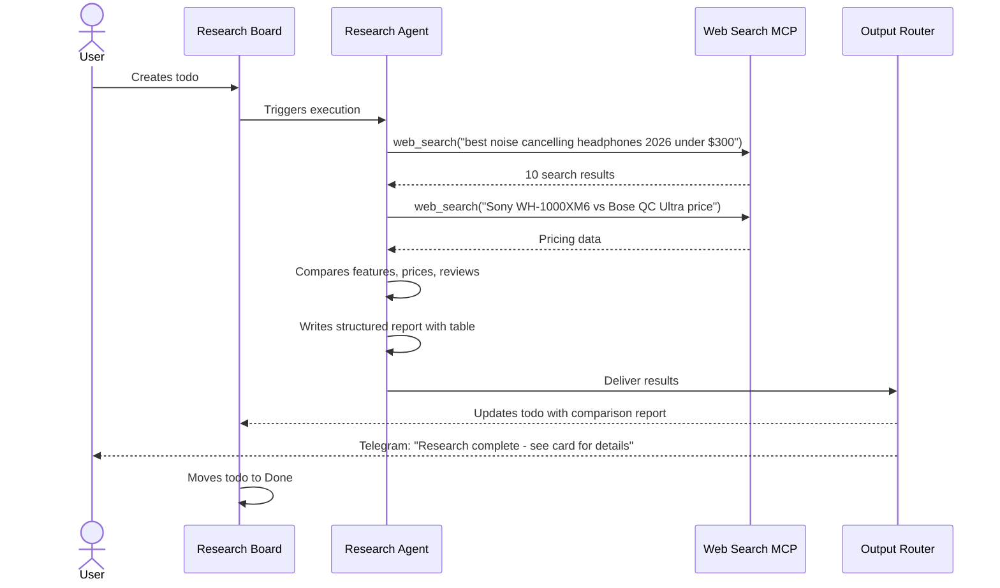

---

### Dev Task

A user creates a todo: "Add rate limiting to the /api/todos endpoint"

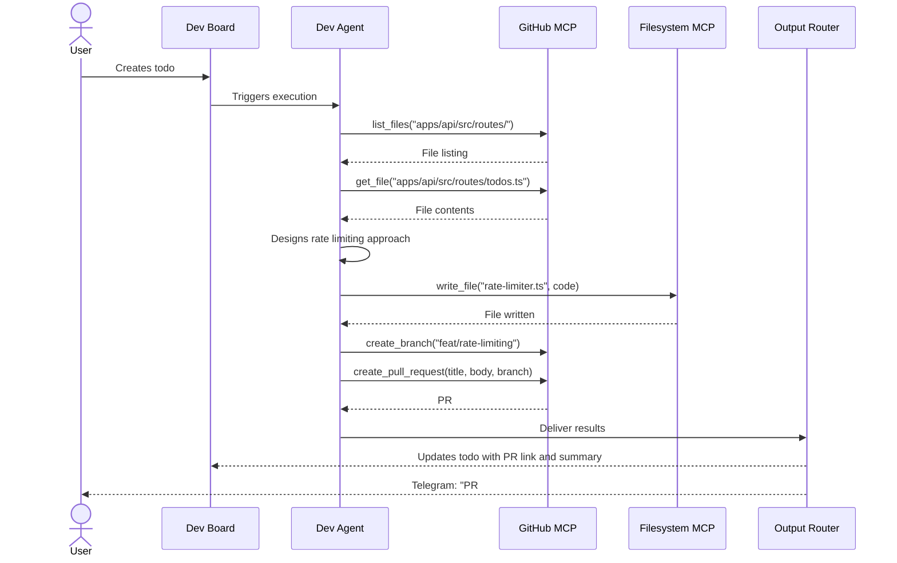

---

### Health Task

A user creates a todo: "Create a 4-week strength training plan for beginners"

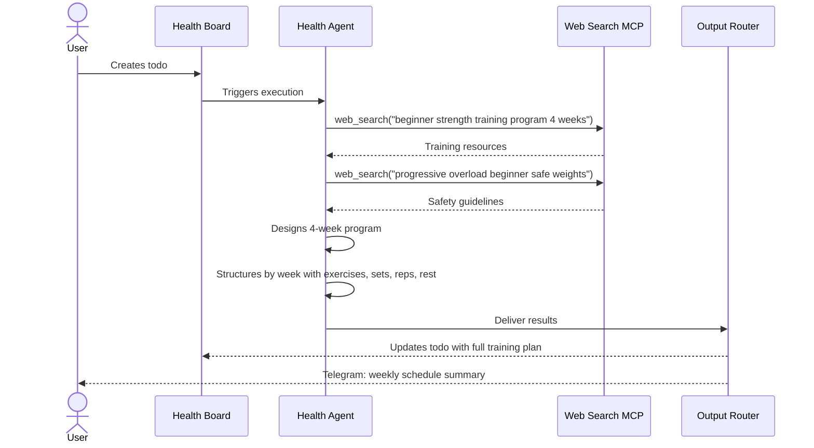

---

### Finance Task

A user creates a todo: "Analyze my spending categories from last month and suggest savings"

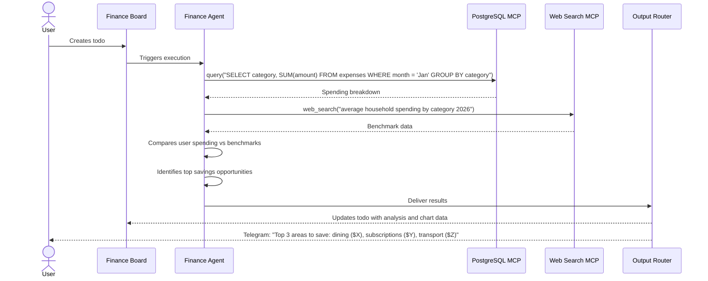

---

## Current Status

InZone today is a fully functional kanban board application with:

- Multiple boards with customizable columns
- Drag-and-drop cards with smooth animations
- Rich text editing via Tiptap
- Labels, tags, and board templates
- Jira-like detail side panel
- Mobile-first responsive design
- Toast notifications with undo support
- Authentication via Better Auth
- PostgreSQL database with Prisma ORM
- Deployed on Vercel with Neon PostgreSQL

This foundation provides the board, column, and todo infrastructure that the AI agent platform builds upon. The kanban UI becomes the interface for managing and monitoring autonomous agent work.

---

## Contributing

InZone is an open-source project and contributions are welcome. Whether it is a bug fix, a new MCP server integration, an output handler, or a board template -- all contributions help make the platform better.

To get started:

1. Fork the repository
2. Create a feature branch
3. Make your changes (run `pnpm vitest run --coverage` in `apps/web/` to verify tests)
4. Submit a pull request

See the [architecture document](.claude/plans/ai-agent-platform-architecture.md) for technical details on the agent platform design.

---

*Last updated: 2026-02-22*
